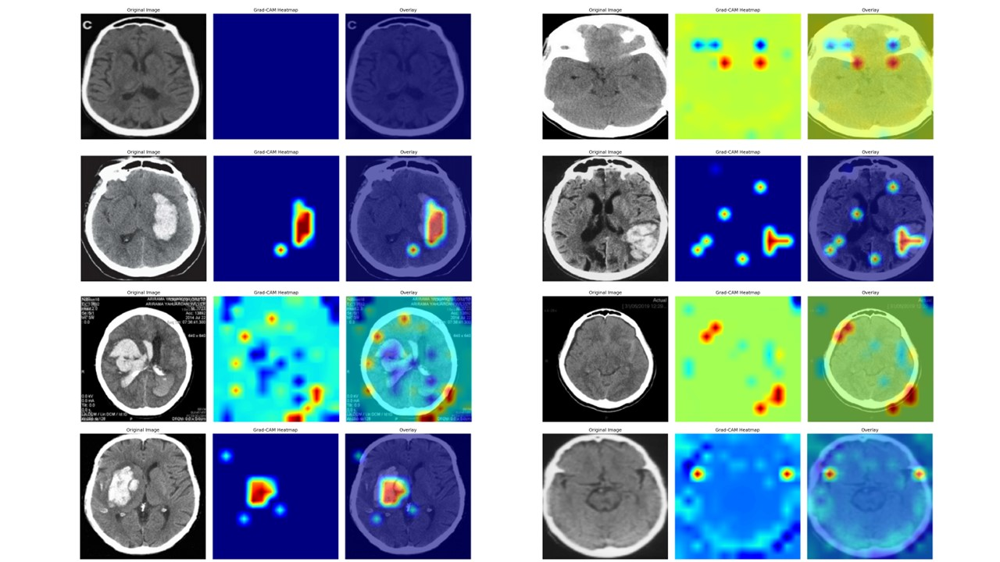

# CT Brain Tumor Classification

A deep learning project for classifying CT brain scans to detect tumors using various neural network architectures including ResNet, Vision Transformer (ViT), and ResNet-ViT(RNViT) hybrid models.

## Overview

This project implements multiple deep learning models for binary classification of CT brain scans:
- **Healthy**: Normal brain tissue
- **Tumor**: Brain tissue with tumor

The project features a progressive training approach where the training dataset size increases dynamically during training epochs.

## Architecture

### Models Supported
- **ResNet50/101**: Convolutional Neural Networks for feature extraction
- **Vision Transformer (ViT)**: Transformer-based architecture for image classification
- **RNViT**: Hybrid model combining ResNet backbone with Vision Transformer
- **MobileNetV2**: Lightweight CNN for mobile deployment
- **EfficientNet**: Compound scaling CNN architecture

### Key Features
- Progressive training with milestone-based dataset expansion
- A complete classify framwork(if you need to expand model would be easily)
- Grad-cam tool for model explainity
- Advanced visualization tools for training history and model comparison
- Flexible data loading with augmentation support

## Project Structure

```
CT-brain/
├── config.py                      # Configuration settings
├── train.py                       # Training script (progressive training)
├── test_inference.py              # Test set creation + evaluation (auto 10% split)
├── grad-cam.py                    # Grad-CAM / attention visualization for RNViT
├── model/                         # Model architectures
│   ├── __init__.py
│   ├── resnet_model.py           # ResNet implementation
│   ├── vit_model.py              # Vision Transformer implementation
│   └── rnvit_model.py            # ResNet-ViT hybrid model
├── utils/                         # Utility functions
│   ├── generate_dataset.py       # Progressive dataset loader
│   ├── model_select.py           # Model selection utilities / seed
│   ├── utils.py                  # Misc helpers
│   ├── plot.py                   # Visualization tools (history, comparison, confusion matrix)
│   └── dims_check.py             # Shape / embedding debug helper
├── CT_meta/                       # Main dataset (Healthy / Tumor)
├── checkpoints/                   # Saved models & training histories
├── evaluation_results/            # Evaluation reports & plots
├── training_plots/                # Generated training history figures
└── gradcam_results/               # Grad-CAM output images
```

## Getting Started

### Prerequisites

```bash
pip install scikit-learn
pip install matplotlib seaborn
pip install numpy pandas
pip install tqdm
pip install torch==2.7.1 torchvision==0.22.1 torchaudio==2.7.1 --index-url https://download.pytorch.org/whl/cu118
```

### Dataset Structure

**Organize your CT scan images:**
   ```
   CT_meta/
   ├── Healthy/
   │   ├── ct_healthy_001.jpg
   │   ├── ct_healthy_002.jpg
   │   └── ...
   └── Tumor/
       ├── ct_tumor_001.jpg
       ├── ct_tumor_002.jpg
       └── ...
   ```

### Configuration

Edit `config.py` to customize your training settings:

```python
# Model selection
model_list = ["rn_vit_base_patch16_224"]  # Available models

# Training parameters
training_batch_size = 16
training_epoch = 150
training_LR = 0.0001

# Dataset settings
image_size = 224
num_classes = 2
```

## Training

### Progressive Training

The project uses a progressive training approach where training data is gradually increased:

```bash
python train.py
```

**Progressive Milestones:**
- Epoch 0: Start with initial subset of training data
- Epoch 10, 15, 20, 25: Add more training samples at each milestone

### Training Features
- **Dynamic Dataset Expansion**: Training dataset size increases at predefined milestones
- **Data Augmentation**: Random horizontal flip and normalization
- **Automatic Checkpointing**: Model weights and training history saved automatically
- **Comprehensive Logging**: Training metrics tracked and saved as JSON

## Evaluation

### Comprehensive Model Evaluation

Quick evaluation with automatic 10% test split (recommended):
    ```bash
    python test_inference.py
    ```
    Edit the `MODEL_PATH` variable inside `test_inference.py` before running. This script:
    - Rebuilds a fresh `CT_test/` (10% per class, sampled once per run)
    - Loads the specified model checkpoint
    - Computes metrics + confusion matrix (+ ROC for binary)
    - Saves results under `evaluation_results/`

**Metrics Calculated:**
- **Accuracy**: Overall classification accuracy
- **Precision**: True positive rate for each class
- **Recall/Sensitivity**: Ability to detect positive cases
- **Specificity**: True negative rate
- **F1-Score**: Harmonic mean of precision and recall
- **AUC-ROC**: Area under ROC curve
- **Confusion Matrix**: Detailed classification breakdown

### Visualization Tools

```python
from utils.plot import plot_history, plot_metrics_comparison

# Plot single model training history
plot_history('history.json', 'RNViT_Model')

# Compare multiple models
histories = {
    'RNViT': 'rnvit_history.json',
    'ResNet': 'resnet_history.json'
}
plot_metrics_comparison(histories)
```

## Results Visualization

### Training History Plots
- **Loss Curves**: Training and validation loss over epochs
- **Accuracy Curves**: Training and validation accuracy progression
- **Metrics Dashboard**: Precision, Recall, F1-Score tracking
- **Learning Rate Schedule**: Dynamic learning rate visualization

### Evaluation Reports
- **ROC Curves**: Receiver Operating Characteristic analysis
- **Precision-Recall Curves**: Performance at different thresholds
- **Confusion Matrix**: Detailed classification results
- **Model Comparison**: Side-by-side performance analysis

### Grad-CAM Example

Example RNViT Grad-CAM visualization (salient regions associated with prediction):



Generate your own:
```bash
python grad-cam.py
```
Images will be saved to `gradcam_results/`. Replace or update the image path above if you produce alternative samples.

## Model Architecture Details

### RNViT (ResNet-Vision Transformer)
```
Input (224x224x3) 
    ↓
ResNet Backbone (Feature Extraction)
    ↓
Patch Embedding (16x16 patches)
    ↓
Transformer Encoder Layers
    ↓
Classification Head
    ↓
Output (2 classes)
```

### Progressive Training Strategy
```
Epoch 0-9:    25% of training data
Epoch 10-14:  50% of training data  
Epoch 15-19:  75% of training data
Epoch 20+:    100% of training data
```

## Usage Examples

### Basic Training
```python
from utils.generate_dataset import ProgressiveImageFolderDataset

# Initialize progressive dataset
data_module = ProgressiveImageFolderDataset(
    image_path="./CT_meta",
    batch_size=16,
    valid_ratio=0.2,
    milestones=[10, 15, 20, 25]
)

# Training loop
for epoch in range(num_epochs):
    data_module.set_epoch(epoch)  # Dynamic dataset expansion
    train_loader = data_module.train_dataloader()
    # ... training code
```

### Model Evaluation
```python
from evaluate_model import ModelEvaluator

# Initialize evaluator
evaluator = ModelEvaluator(model, device='cuda')

# Get predictions
predictions, probabilities, labels = evaluator.predict(test_loader)

# Calculate comprehensive metrics
metrics = evaluator.calculate_metrics(labels, predictions, probabilities)
```

## Advanced Features

### Test Dataset Creation

`test_inference.py` automatically:
- Deletes and recreates `CT_test/`
- Randomly samples 10% per class (minimum 1 image) as the test set

If you want a fixed (stable) test set:
1. Run `python test_inference.py` once.
2. Comment out the call to `TestDatasetGenerator.create_test_dataset()` inside the script.
3. Future evaluations will reuse the same `CT_test/` without re-sampling.

### Custom Model Integration
```python
# Add new model to model/ directory
# Update config.py model_list
# Implement model class with required methods
```

### Hyperparameter Optimization
- Modify `config.py` for different learning rates
- Adjust milestone epochs for progressive training
- Customize data augmentation parameters

## File Descriptions

- `config.py`: Global configuration (paths, hyperparameters)
- `train.py`: Progressive training loop implementation
- `test_inference.py`: Sampling + evaluation (Accuracy / Precision / Recall / F1 / Specificity / AUC / Confusion Matrix / ROC)
- `generate_test.py`: Legacy test & evaluation script (Chinese output; keep only for historical reference)
- `grad-cam.py`: Generate RNViT Grad-CAM visualization
- `utils/generate_dataset.py`: Progressive dataset loader (milestone-based expansion)
- `utils/plot.py`: History / comparison / confusion matrix plotting utilities
- `utils/model_select.py`: Model selection + seeding helpers
- `utils/dims_check.py`: Helper to inspect tensor / embedding dimensions
- `model/rnvit_model.py`: ResNet + ViT hybrid
- `model/resnet_model.py`: ResNet backbone
- `model/vit_model.py`: Vision Transformer
- `checkpoints/`: Saved models & histories
- `evaluation_results/`: Reports & evaluation plots
- `training_plots/`: Generated training curves
- `gradcam_results/`: Grad-CAM outputs


## Data Sources

The dataset used for this project is NOT distributed with the repository. You must download it separately from Kaggle after logging in and accepting the license terms. The raw data directory is excluded via `.gitignore` so no original images are tracked here.

### Dataset
Murtoza Likhon, Brain tumor multimodal image (CT & MRI) [Data set], Kaggle, 2024. License: Creative Commons **CC BY-NC-SA 4.0** (Attribution, Non‑Commercial, Share Alike). Always review the dataset page for the most up‑to‑date terms.

Kaggle page:
https://www.kaggle.com/datasets/murtozalikhon/brain-tumor-multimodal-image-ct-and-mri

### Acquisition
1. Sign in to Kaggle.
2. Navigate to the dataset page above.
3. Accept the license / terms if prompted.
4. Download the archive and extract it locally.
5. Organize (or symlink) CT images into the expected structure used here:
     ```
     CT_meta/
     ├── Healthy/
     └── Tumor/
     ```

If the original dataset uses different naming, rename / map the folders accordingly. Update `config.py` (`image_path`) if you store the data elsewhere (e.g. `D:/datasets/brain_ct/CT_meta`).

### Usage & Reuse Notes
Under CC BY-NC-SA 4.0 you MUST:
- Provide attribution (cite the author & source)
- Use only for non-commercial purposes
- Share derivative datasets/models under the same license if redistributed
- Not impose additional legal or technical restrictions

Do NOT use the data (or models trained directly on it) for commercial or clinical decision-making without proper authorization and validation.


### Environment / Path Configuration
Edit `config.py` to change `image_path`. If you externalize data, keep the same subfolder names. Large datasets can be mounted (e.g. a network drive) and pointed to without copying.

### Citation (Plain)
Murtoza Likhon. Brain tumor multimodal image (CT & MRI) [Data set]. Kaggle. 2024. License: CC BY-NC-SA 4.0.

### Citation (BibTeX)
```bibtex
@dataset{likhon_2024_brain_tumor_multimodal,
    author    = {Murtoza Likhon},
    title     = {Brain tumor multimodal image (CT & MRI)},
    year      = {2024},
    publisher = {Kaggle},
    note      = {License: CC BY-NC-SA 4.0},
    url       = {https://www.kaggle.com/datasets/murtozalikhon/brain-tumor-multimodal-image-ct-and-mri}
}
```

### Ethical Notice
This repository is for research and educational purposes. Medical imaging models require rigorous clinical validation before any deployment in diagnostic settings.

---